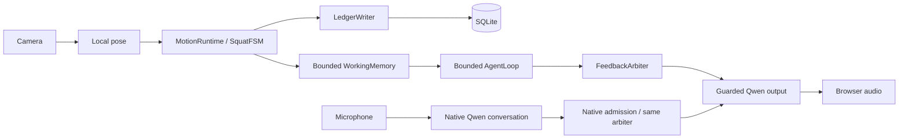

# Motion Relay

基于 Python、Vision-Agents、Qwen Realtime 和本地姿态规则的实时 AI 运动教练研究原型。浏览器采集摄像头/麦克风并播放音频；桌面界面展示本地动作事实；SQLite 保存可追溯训练记录。

> 当前本地权威动作实现是 **SquatFSM（深蹲）**。UI 中其他动作选项不表示已有对应本地计数算法。项目不提供医疗诊断、伤害预测或运动安全保证；本分支尚不是 production-ready。

## 架构概览



权威计数来自本地Runtime，不来自模型口述。本轮加入暂停锁存、流边界保护、操作容量管理、受控反馈仲裁和更可靠的账本失败状态。**V2.1 默认会话已把原生输出接入共享准入**；响应身份过滤、单 pending 注入和取消隔离同步生效。原生内容的事实验证、手动/自动请求的严格因果对应与真实播放 ACK 仍未完成；未连接 gate 的独立 adapter 仍保留兼容旁路。详细边界见 [Architecture V2](docs/ARCHITECTURE_V2.md)。

## Requirements

Python `>=3.13,<3.14`，`uv`，支持Tk的Python运行环境，浏览器、摄像头/麦克风权限。真实对话需要自行配置有效的DashScope密钥；离线单元测试不需要该密钥。

依赖由 `uv.lock` 固定，包括 vision-agents0.6.9、mcp1.29.1、aiortc1.14.0。已验证自动测试环境为Linux/Python3.13.15；真实Mac硬件和云服务链路未在本轮重新验收。

## Quickstart

```bash
git clone https://github.com/lyy26299/motion-relay.git
cd motion-relay
git switch research/agent-architecture-v2
uv sync --locked
cp .env.example .env
# 编辑 .env，填入自己的 DASHSCOPE_API_KEY，不要提交该文件。
./run.sh
```

`run.sh` 使用项目 `.venv/bin/python`，先运行本地配置检查，再打开桌面训练台。浏览器边缘负责音视频输入/输出。`YOLO_DEVICE=mps` 适用于相应Mac环境；没有MPS时使用本机支持的设备配置。

## Environment

| 变量 | 用途 |
|---|---|
| DASHSCOPE_API_KEY | 真实Qwen服务密钥，必须保持私密 |
| DASHSCOPE_BASE_URL | 与密钥区域匹配的Realtime WebSocket地址 |
| COACH_USER_ID | 长期记忆用户隔离，默认local-user，不要填写密钥 |
| COACH_MEMORY_DB | 本地SQLite路径 |
| YOLO_DEVICE | 本地姿态推理设备 |
| QWEN_REALTIME_MODEL / QWEN_VOICE | 模型与声音配置；实际可用性由服务环境决定 |
| QWEN_VAD_TYPE / THRESHOLD / SILENCE_MS | VAD配置，完整变量名见 `.env.example` |
| COACH_AUDIO_START_BUFFER_MS / REBUFFER_MS / MAX_BUFFER_MS | 音频预缓冲和容量，完整变量名见 `.env.example` |

SQLite运行库不只由Python包锁决定；生产使用前须核验官方WAL修复及供应商补丁。见 [Migration](docs/ARCHITECTURE_MIGRATION.md)。

## Tests and benchmark

```bash
uv sync --locked --extra dev
uv run --no-sync python -m unittest discover -s tests -v
uv run --no-sync ruff check . --select E9,F63,F7,F82
uv run --no-sync python scripts/benchmark_architecture.py --iterations 5000 --output /tmp/motion-benchmark.json
```

V2.0 固定基线91项、重构后124项全部通过；当轮新增33项覆盖暂停/流切换、快照、writer关闭、取消、仲裁、Qwen事件竞争和pose→mock voice集成。包含本地WebRTC回环，不调用真实云模型。V2.1 再新增38项语音边界和4项基准隔离测试，完整 CI 为166项全部通过（代码快照dc1ddd7）；本轮实际 CI 结果和固定测量见 [TEST_REPORT](docs/TEST_REPORT.md)。

benchmark只测本地合成fixture，不包含摄像头、YOLO、网络模型或TTS。此次强化事实所有权增加了ingest开销，不能解释成系统全面提速。

## Repository structure

```text
agent_local.py              Tk UI与有限控制队列
agent_local_agent.py        SessionController与媒体/记忆组装
coach/models.py            观测、事件、动作记录
coach/runtime.py           权威动作入口与应用暂停
coach/exercises/            当前SquatFSM
coach/working_memory.py     有界会话快照
coach/agent_loop.py         预算、证据、scope、决策执行
coach/operations.py         未完成操作容量所有权
coach/arbiter.py            单槽反馈准入
coach/session_agent.py     业务触发与受控语音桥接
coach/qwen_duplex.py        Qwen事件/取消/注入guard
coach/voice_state.py        单响应身份与有限退役窗口
coach/browser_edge.py       浏览器WebRTC与音频队列
coach/memory/               账本、writer、检索、整合
coach/mcp_server.py         受控业务工具
scripts/                    检查、smoke与microbenchmark
tests/                      unittest与本地集成测试
docs/                       技术文档、研究、ADR、迁移与证据
```

## Documentation

[架构总说明](docs/ARCHITECTURE_V2.md) · [V2.1语音说明](docs/VOICE_OUTPUT_V2_1.md) · [架构审计](docs/ARCHITECTURE_AUDIT.md) · [外部研究](docs/AGENT_ARCHITECTURE_RESEARCH.md) · [测试与性能报告](docs/TEST_REPORT.md) · [迁移与回滚](docs/ARCHITECTURE_MIGRATION.md) · [ADR](docs/adr)

历史roadmap和设计文档保留，可能包含尚未实现的目标。遇到差异时，以实际代码、对应测试和本轮明确的限制说明为准，不把计划文档当作已上线功能。
