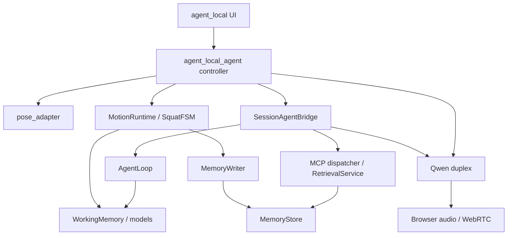

# Motion Relay 架构审计

日期：2026-09-23。基线：`f2f104d3c280972bc9e3aecb75fdafe8c76a4f85`。实现与测试快照：`d45ddeb76badc4f6d5ef77599cdfe9d6865d52d2`。

本报告区分代码事实、工程判断和未验证风险。此次交付是一轮已经实现并验证的增量重构，不是生产就绪认证，也不是对原始需求所有条目的完成声明。

> 版本说明：第1–7节保留 V2.0 审计及当时实现状态；V2.1 语音增量的当前状态见第8节，不将历史“未实现”结论误作最新结论。

## 1. 审计范围与证据等级

完整仓库源码已取得，不依赖空白 README 推测。针对入口、MotionRuntime、SquatFSM、WorkingMemory、AgentLoop、SessionAgentBridge、Qwen 双工适配器、后台 writer 与测试进行了重点检查和实际回归验证。MemoryStore、RetrievalService、MCP、Pose Adapter、Browser Edge、现有文档及脚本用于交叉核对；没有完成每个存储分支、第三方 SDK 和全部历史文档的逐行证明。

证据等级：**复现**表示有基线失败、修改后通过的测试；**代码检查**表示能定位实现路径；**外部风险**表示上游公告或架构推论，尚未在本项目复现。不要把后两类写成已经发生的故障。

原始测试基线：91 项通过。修改后完整依赖环境：124 项通过，增加 33 项，无旧测试删除。详见 [测试报告](TEST_REPORT.md)。

## 2. Documented / Implemented / Runtime Architecture

| 视角 | 应如何阅读 | 真实差异 |
|---|---|---|
| Documented | `TALKER_REASONER_AGENT_ARCHITECTURE.md`、memory design、roadmap 表达意图与未来路线 | 不能据此声称双 LLM、完整 HFSM、统一语音仲裁或向量 RAG 已上线 |
| Implemented | `agent_local_agent.py` 组装本地感知、会话、Qwen 与 SQLite；`session_agent.py::_decide` 是 Python 策略 | 普通实时对话由 Qwen 自行响应；受限 AgentLoop 主要负责结构化事实/历史检索；不是所有对话都走受验证决策 |
| Runtime | Tk 主线程、应用 asyncio loop、姿态推理线程、账本写线程、工具线程，以及浏览器 WebRTC 和云 WebSocket | 单 Agent 的概念标签掩盖了多条输出路径；取消协程不等于线程已停止，生成结束不等于扬声器播放结束 |

### 基线依赖图

重构没有把 FSM 迁入 Agent，也没有使存储层反向控制动作域。新增 `OperationPool` 是执行所有权边界；`FeedbackArbiter` 是应用输出准入边界。修改后的实际连线及仍存在的旁路见 [Architecture V2](ARCHITECTURE_V2.md)。

## 3. 应保留的基础

`PoseSnapshot` 保留 stream epoch、frame ID、处理耗时与单调时钟；姿态处理已有单 worker / latest-frame 策略。`MotionRuntime` 是权威动作入口，事件与 rep 有规则版本和可回放标识。`WorkingMemory` 原本已有容量与时间窗口。

现有 `AgentLoop` 已包含 turn identity、预算、scope、证据准入、relevance guard、过期结果过滤、版本化计划提案和 action receipt。它不是应该为换框架而删除的坏代码。现有 MCP 暴露业务能力，不是任意 SQL。SQLite 事务、幂等写入、用户隔离、删除 epoch 和检索测试值得保留。

现有浏览器音频已有有界预缓冲、背压和 flush；测试包含真实本地 WebRTC 音视频回环。这些能力不能因为新增仲裁类而被重复计算为本轮成果。

## 4. 问题清单

严重度表示修复优先级，不表示已发生事故。

| ID / 严重度 | Evidence | Impact | Recommendation | Implementation status |
|---|---|---|---|---|
| A01 High | 基线 `MotionRuntime.pause/ingest` 与 FSM 站立恢复路径；新增持续来帧测试复现 | 应用仍暂停时，计数可以恢复 | 应用暂停锁存，只有显式 resume 解除 | **已修复并测试** |
| A02 High | 基线 ingest 接受新 stream epoch，但保留上一流半次动作；新增测试复现 | 两个摄像头流拼成一次 rep | epoch 切换丢弃 partial rep，再站立恢复 | **已修复并测试** |
| A03 High | `SessionAgentBridge._decide/_tool/_inject` 的同步 SQLite 路径 | 磁盘/锁竞争阻塞应用 loop | 同步 IO 移入有所有权的有界操作池；安全暂停不等 DB | **已实现；慢存储测试通过** |
| A04 High | 基线 guarded call 等待被取消操作退出 | 不合作 coroutine 令截止时间失效 | deadline/cancel race 后立即失效结果；遗留工作仍占容量 | **已实现；不合作异步与线程测试通过**，不保证强制终止 |
| A05 High | Agent actor 返回前才过滤 stale，副作用已可能发生 | 过期检索结果仍发到 Qwen | actor 和 provider 在每个 await 后、网络副作用前复查 | **已实现受控注入路径**，不是全局原子发送 |
| A06 High | `coach/arbiter.py` 原为空；优先级隐藏在回调时序 | 回答、报数与提示互相覆盖 | 单槽准入、TTL、去重、cooldown、抢占 | **已接入 bridge**；原生 Qwen 仍旁路 |
| A07 High | 基线 `response.done`/feedback 完成与播放状态混合 | 未听到的话可能被记为已播完；旧 done 结束新反馈 | 严格 response ID；generation_completed 与播放分离 | **已修复已知 done/delta 竞争**；真实播放 ACK 未实现 |
| A08 High | writer overflow 后后续 batch 可将状态改回 saved；close/admission 并发 | 丢账本事实却宣称完整保存 | admission barrier、sticky integrity failure、显式 interrupted | **已修复并复现**；溢出仍可能丢新事实 |
| A09 Medium | frozen dataclass 中 `CoachEvent.facts` 仍可变；新增测试复现 | 快照消费者可污染权威事件 | 写入 WorkingMemory 时递归冻结 JSON facts | **已修复**；不是对恶意同进程 Python 的沙箱 |
| A10 Medium | `started_at or now`、`occurred_at or now`；零时钟测试复现 | 回放时间 0 被误当缺失值 | 使用 `is None` | **已修复** |
| A11 Medium | bridge / observer task fanout 与 UI 控制队列缺少统一上界 | burst 与卡住操作积压 | bridge 4 + latest 1，IO 4，observer 上限，UI 16 | **本轮边界已实现**；未审计全部 SDK 内部队列 |
| A12 Medium | 基线 Actions 的 `tee` 未配 pipefail | 测试失败可能被末端命令成功掩盖 | Bash pipefail，保存原始日志和版本 | **已修复**；基线原始日志实际为 OK |
| A13 High | `qwen_duplex.py` 普通自动回复不经过 validated actor | 无统一 final-answer evidence / speech arbitration | 统一请求代次与输出准入，或明确划分受控/非受控模式 | **未完成** |
| A14 High | UI exercise 可变化，但 Runtime 仍构造 SquatFSM，history 策略写死 squat | 其他动作的本地计数/记录可能语义不匹配 | 新增 ExerciseDefinition/registry，并按能力禁用不支持的权威计数 | **未实现**；README 限定本地动作事实为深蹲 |
| A15 High | response.created 与取消后的新请求缺少完整应用 correlation | 迟到创建事件仍有归属歧义 | provider adapter 持久携带 request generation 并测试全部交错 | **部分缓解，未完整解决** |
| A16 Medium | 当前日志无完整 capture→playout trace，SDK 输出不可等同扬声器输出 | 无法归因端到端延迟，也不能证明用户听到了什么 | 本地 trace + 浏览器 ACK + 时钟映射 | **仅日志/计数器基础，完整 tracing 未实现** |
| A17 High（生产存储门槛） | CI 实际 SQLite 3.45.1；官方 2026 WAL-reset 公告 | 版本号落在上游受影响范围；需核对发行商补丁 | 使用含修复的运行库，验证 source_id/供应商补丁再做持久化实验 | **未升级、未复现损坏**；不是断言本机已损坏 |
| A18 Medium | OperationPool 是每个 owner 的上界；线程不可被 Python 安全杀死 | 多次重建会话或默认 executor 退出仍可能等待旧线程 | 服务级池/进程隔离、provider 原生 timeout、监督式退出 | **已记录剩余风险** |
| A19 Medium | 单槽 lease 以 TTL 结束，尚无 speech-duration/真实播放完成调度 | 长回答可能被截断；低优先级提示被舍弃 | 输出预算与浏览器播放回执联合驱动 lease | **未完成** |

SQLite 来源：[官方 WAL-reset 说明](https://www.sqlite.org/wal.html#walreset)，页面更新 2026-04-13。公告限定于多连接并发写/检查点的稀有竞争；运行库版本号不能排除发行商已回移补丁。生产发布前需完成核验，本轮没有宣称修复 SQLite 引擎。

## 5. 本轮未选择的“大重构”

没有按文件长度拆分全部 AgentLoop，没有迁移 LangGraph，没有增加 Actor 框架、消息中间件或微服务。当前可复现问题发生在状态所有权和 await/输出边界，不在框架缺失。先用测试锁定行为，比把同样竞争搬入新目录更有效。

没有实现新的运动、向量数据库、自动 LLM 记忆整合或通用 provider registry。保留现有数据库 schema 与工具名称，减少迁移风险。

## 6. 需求完成度与未覆盖验收

| 工作包 | 当前状态 | 仍欠缺的验收 |
|---|---|---|
| 核心架构地图、权威状态、并发边界 | 已分析并形成文档 | 全仓库逐行审计、所有 SDK 边界的独立复核 |
| 暂停、epoch、时间零点、快照所有权、writer 关闭 | 已实现并测试 | 多小时真实摄像头/磁盘压力回放 |
| bounded AgentLoop、bridge IO、反馈准入、已知语音竞争 | 已实现并测试 | 原生对话统一接入、完整 response.created 交错 |
| MCP / memory / evidence | 保留并验证现有 contract | spoken claim 的语义正确性、完整删除广播、跨进程一致性 |
| 性能 | 同机同 harness 微基准已测量 | 摄像头、YOLO、网络 LLM、TTS、真正播放的 P50/P95/P99 |
| 研究与文档、ADR、迁移、测试报告 | 本轮交付 | 用户实验和反馈策略效用验证 |
| 生产级安全/可观测/扩展 | 设计与风险清单 | 离线告警、完整 tracing、exercise/provider 插件实现、发布加固 |

## 7. 审查结论

最关键的改善不是“有了一个 arbiter 文件”，而是：暂停有单一所有者，取消后的工作继续计入容量，输出前再次验证，账本缺口不能被后续成功覆盖。最关键的未完成项是统一实际语音出口。当前分支应作为 Draft PR 审查，不应仅凭 124 项测试就标记 production-ready。

## 8. V2.1 语音输出增量审计

增量起点 `46a2061`，实现 `2f08e8d`；范围限定于响应身份、原生准入、等待注入、取消及生命周期，不重复声称完成全仓库逐行审计。代码及测试对应 [VOICE_OUTPUT_V2_1](VOICE_OUTPUT_V2_1.md)。

| 对应问题 | 新证据/修改 | 当前状态与剩余限制 |
|---|---|---|
| A06 / A13 原生旁路 | Controller 接 native gate；Bridge 同一 arbiter；原生拒绝/安全抢占/无数据库准入测试 | 默认入口输出准入已接入；原生内容证据验证仍未完成；独立 adapter 可不接 gate |
| A07 终结语义 | 显式 completed、failed、incomplete、cancelled、unknown；缺失 ID 不回退 | 已实现相应事件处理；真实播放 ACK 仍未实现 |
| A15 created 竞争 | ResponseWindow 单活动、重复幂等、退役256项；pending单槽、打断/不确定发送后阻断；新SDK边界测试 | 已缓解已知交错；未证明客户端请求因果；ordered candidate 标注 unverified |
| 新 High：旧 reader / cancel 污染继任 | reader捕获client和epoch；取消先本地失效，最多一个 task，等待预算0.2秒 | 覆盖旧reader和取消不结束测试；完整SDK close/executor进程退出仍无硬保证 |
| 新 Medium：普通final转录重复撤销 | VAD单独标记，普通final不再次中断新原生回答；路由问题仍撤销 | 覆盖常见顺序；不是完整ASR item ID关联 |
| 新 Medium：畸形包/字幕绕过guard | 字幕与音频同guard；解析拒绝外来item、无ID、畸形Base64/非对象事件 | 已实现相应防御测试；未对任意畸形协议做穷尽fuzz |
| A19 输出生命周期 | 原生lease暂定12秒，pending创建期限4秒，有限ID窗口 | 都是工程默认；未做speech-duration调度和真人听感验证 |

可用性代价必须暴露：无法确认响应归属时保守停止输出，操作者可能需要重建会话。丢弃本地音频不等于云端停止生成/计费；全双工体验仍需真实模型与硬件验收。新38项测试结果见 TEST_REPORT 的 V2.1 记录，而非据代码审查直接宣称通过。
