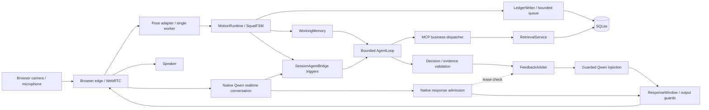
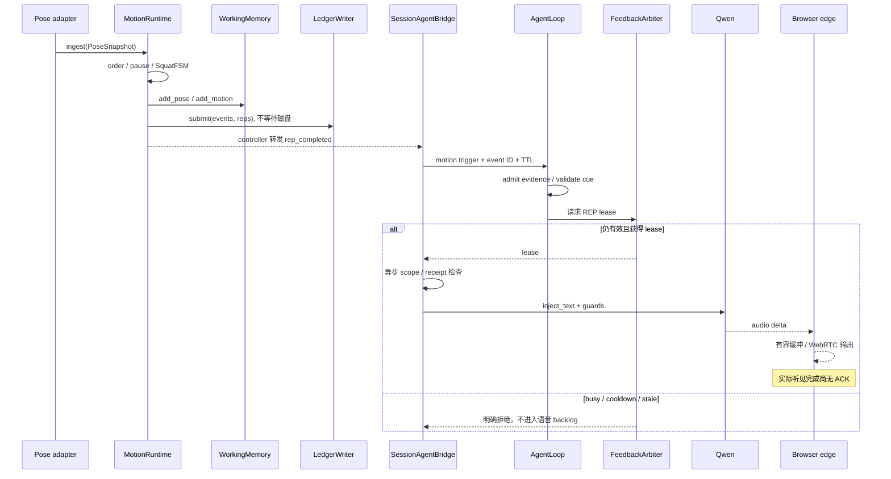
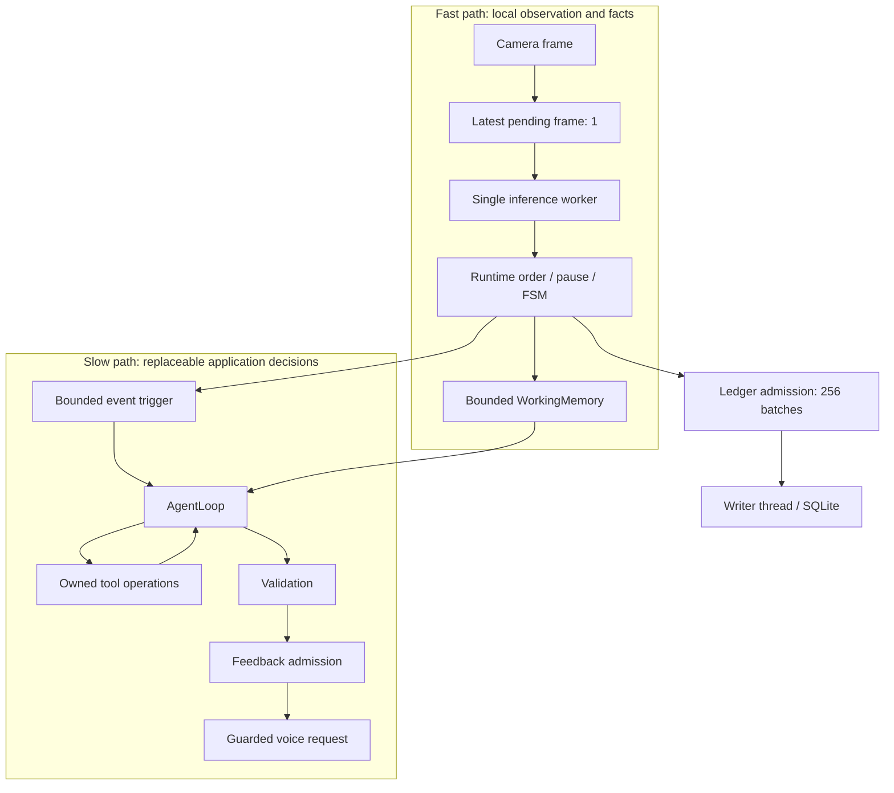
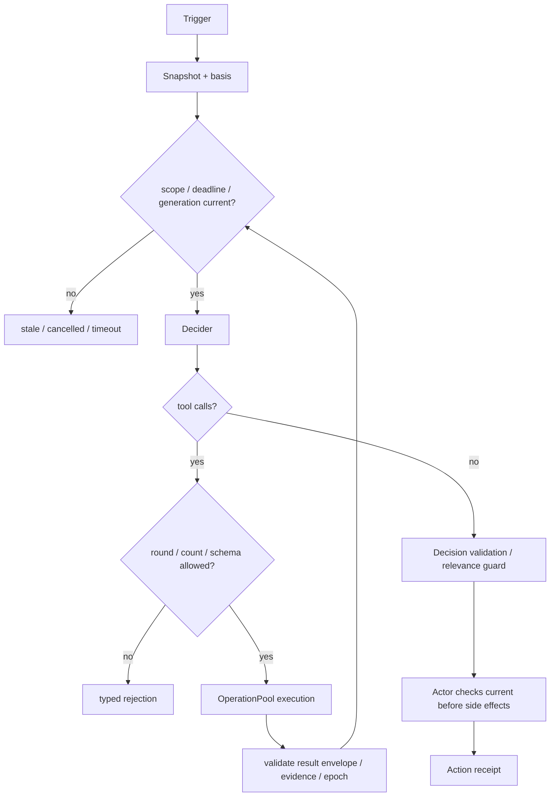
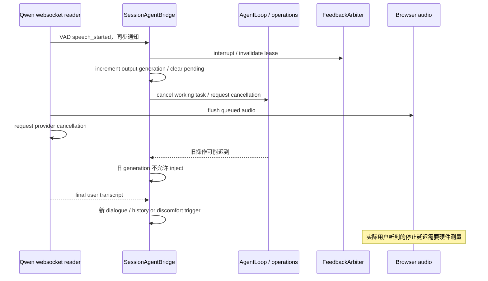
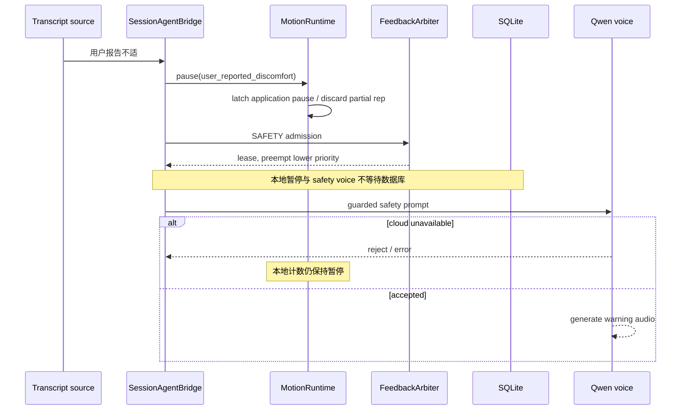
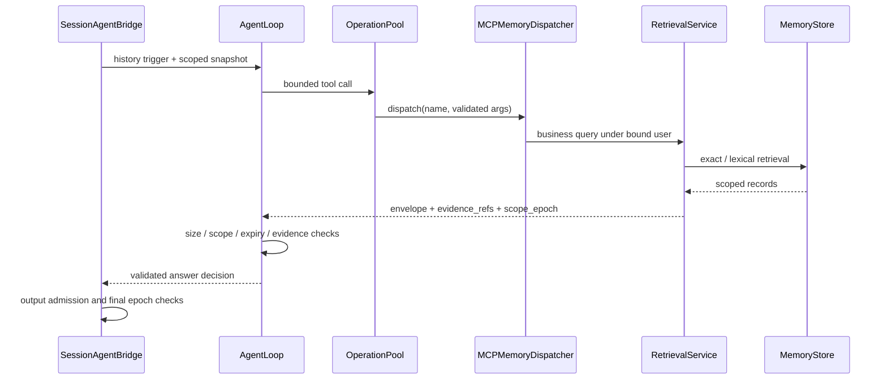
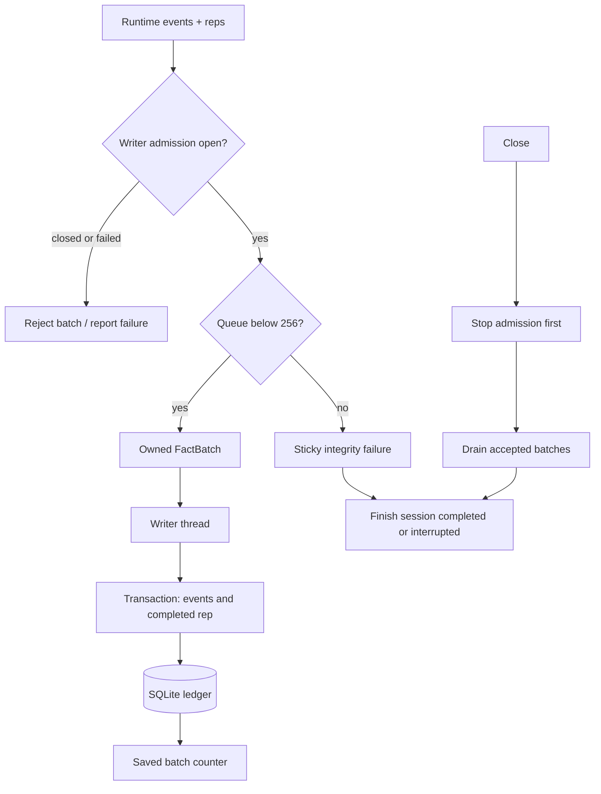
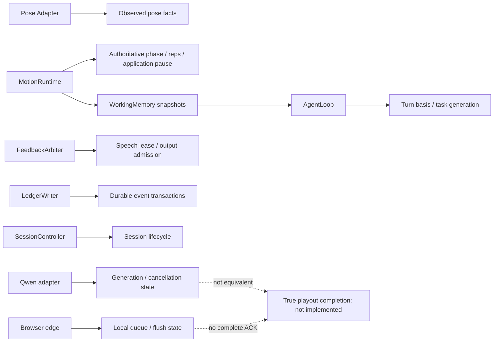
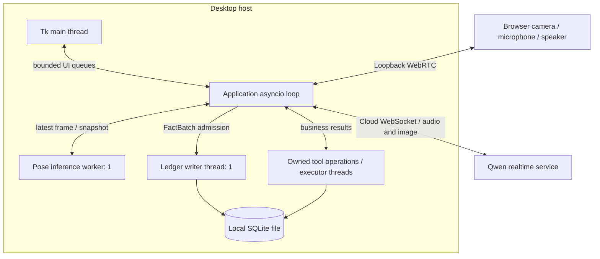

# Motion Relay Architecture V2（含 V2.1 语音增量）

日期：2026-09-23。代码基线：`f2f104d3c280972bc9e3aecb75fdafe8c76a4f85`。V2.0 已验证快照：`d45ddeb76badc4f6d5ef77599cdfe9d6865d52d2`。V2.1 增量起点：`46a2061fedebdd15c52cc4e8bd2441683ae01d14`；语音实现：`2f08e8d494bce3cd1ec8b6d6c203dd38757d17b5`。

这是面向首次接手项目工程师的运行时说明。**本文件已同步 V2.1 实际连线；未修改的领域/存储模块沿用 V2.0。** 默认 SessionController 的原生输出已接入共享准入；原生内容的事实验证、手动/自动响应的严格因果关联、真实播放 ACK、完整 exercise 插件和生产级 tracing 仍未完成。语音详细契约见 [VOICE_OUTPUT_V2_1](VOICE_OUTPUT_V2_1.md)，关键变化见第37节。测试与基准的实测证据见 [TEST_REPORT](TEST_REPORT.md)，缺陷定位见 [AUDIT](ARCHITECTURE_AUDIT.md)，外部依据见 [RESEARCH](AGENT_ARCHITECTURE_RESEARCH.md)。

## 1. Problem Definition

用户运动时不能一直看屏幕，系统需要持续理解动作，在合适时机说有依据的话，并允许用户随时打断。这里至少有三种不同的正确性：动作事实正确、决定执行时仍有效、语音确实按预期播放。模型回答流畅只涉及其中一小部分。

摄像头输入是高频、有噪声的观测。SQLite、网络模型和音频播放可能慢于动作状态变化。因此“每帧交给 Agent 决定并排队播出”不是当前设计：本地状态必须先独立前进，慢任务只读快照和事实，过期结果必须失效。

## 2. Design Goals / Non-goals

本轮目标是修复可复现的边界错误：显式暂停、跨摄像头 partial rep、可变事件快照、账本溢出状态、阻塞 IO、不合作取消、已知迟到语音事件，以及缺失的受控反馈准入。

不追求一次性重写、微服务化、框架替换、所有 provider 支持或所有动作识别。本轮不是训练处方、医疗判断或人体伤害检测系统，也没有验证用户运动表现/坚持度改善。

## 3. First Principles

动作事实需要连续状态与可回放规则，因此由 `MotionRuntime/SquatFSM` 所有。网络模型需要灵活表达，但不能成为计数真相来源。慢任务应该可以被舍弃，而不是阻止本地状态更新。语音是一条有限资源，低价值消息过期后应该不说，而不是补播。持久化是另一条生命周期：进入队列不等于提交成功，提交成功也不自动证明断电可恢复。

这些原则导出的是有界交接和明确所有权，而不是某个框架名称。当前 `SessionAgentBridge._decide` 主要是 Python 规则，并非第二个独立 Reasoner LLM；普通对话仍由 Qwen realtime 处理。

## 4. Current Architecture 与本轮变化

基线已经具有单次姿态推理复用、确定性 FSM、bounded working memory、evidence-carrying AgentLoop、本地业务 MCP 和后台账本。不能把这些已有能力记为本轮新增。

本轮增加应用暂停 latch、流切换断开半次动作、JSON facts 冻结、OperationPool、FeedbackArbiter、bridge 容量限制、受控语音有效性检查、ID 过滤和 writer admission barrier。保留现有数据模型、数据库 schema、工具名称和主要入口。

## 5. System Architecture — 实际实现

V2.1 中，默认 SessionController 将原生响应交给 `admit_native_response`，共享同一个 FeedbackArbiter，并与受控注入共同经过显式 response ID / guard 检查。**输出准入不等于内容验证**：原生内容仍不经过 AgentLoop evidence validation；混合自动/手动模式中的注入候选仍标记 `response_correlation=unverified`。独立构造 adapter 而不连接 native gate 时仍保留兼容旁路。

## 6. Component Responsibilities

| 模块 | 负责 | 不负责 |
|---|---|---|
| `agent_local.py` | Tk UI、设备选择、有限 UI/action 队列 | 不生成权威 rep，不直接执行 LLM 工具 |
| `agent_local_agent.py` | SessionController 组装、会话启停、watchdog、sink 连接 | 不自行重复实现角度/动作阶段 |
| `coach/pose_adapter.py` | 单 worker 推理、frame/epoch 顺序、CPU-only PoseSnapshot | 不推断用户身份，不写长期训练事实 |
| `coach/exercises/squat.py` | 深蹲时序规则、partial rep、有效性及规则证据 | 不访问网络、数据库、UI、LLM |
| `coach/runtime.py` | 权威动作入口、应用暂停、流边界、事实交付 | 不从语言模型输出增加计数 |
| `coach/working_memory.py` | 有界会话快照与状态版本 | 不作为完整历史数据库 |
| `coach/agent_loop.py` | 受限工具/决定循环、scope、evidence、deadline、取消检查 | 不拥有摄像头状态，不保证 actor 任意副作用可回滚 |
| `coach/operations.py` | 未完成操作的容量与异常回收 | 不强制杀死 Python 线程 |
| `coach/session_agent.py` | 业务触发、工具映射、反馈准入、原生回答 lease、受控 Qwen 注入 | 不验证原生回答语义，不证明请求因果关系 |
| `coach/arbiter.py` | 单槽反馈准入、优先级、TTL、去重、cooldown | 不是 TTS，不是完整 speech-duration scheduler |
| `coach/qwen_duplex.py` | WebSocket、单 pending 注入、native gate、严格 ID、取消隔离 | 不把生成事件或候选绑定视为已听见/已证明因果 |
| `coach/voice_state.py` | 单活动 ResponseWindow、256项退役窗口、幂等终结 | 不持有网络、文本、音频或客户端请求归属 |
| `coach/browser_edge.py` | 本地 WebRTC、音频缓冲、flush、loopback 访问约束 | 尚不提供完整浏览器真实 playout ACK |
| `coach/memory/*` | 持久化、业务检索、确定性整合、后台写入 | 不反向创建实时动作事实 |

## 7. State Ownership

“owner”是业务唯一真相来源，不是说 Python 对象可以抵抗恶意同进程代码。跨线程写操作必须通过各自的队列/服务边界。

| State | 创建 / 更新者与 authoritative owner | 读取者 | 持久化与生命周期 | 并发约束 |
|---|---|---|---|---|
| Pose / stream order | Pose Adapter 创建；Runtime 接受顺序 | Runtime、UI、WM | 原始窗口在会话内；不默认保存视频 | 推理线程产出，应用 loop 接纳；旧 epoch/frame 拒绝 |
| Motion / exercise phase | Runtime 内 SquatFSM | WM、UI、bridge | 当前快照会话内；变化写事件 | 应用 loop 单 owner |
| Rep count / valid reps | SquatFSM，经 Runtime 对外 | UI、Agent、ledger | RepRecord 落账本；计数不能由 LLM 更新 | 不接受 Agent 自造 rep |
| Safety / application pause | Runtime.pause/resume；FSM 另有视觉暂停 | WM、UI、bridge | 运行时锁存；不是独立医疗记录 | 显式暂停只能显式解除 |
| Session state | SessionController | UI、Runtime、Agent | 会话元数据在 MemoryStore；每次运行有 session ID | 生命周期统一组装/关闭 |
| Agent turn | AgentLoop + WM task generation | decider、tools、actor | 短期任务状态；结果/receipt 可记录 | 新 turn 或取消令旧 basis 失效 |
| Conversation | Qwen 管理原生上下文；WM 管理有限应用 dialogue | bridge、模型 | 两者不是同一完整历史 | 禁止把任一缓存误称全部对话真相 |
| Playback | Qwen 知道生成/取消；edge 知道排队/flush | bridge receipt、UI | 当前真实“已听完”未知 | 原生 response.done 不是 playback owner |
| User profile | scope-bound MemoryStore | RetrievalService / MCP | 跨会话，版本化来源 | 模型只可提出更新，不自行选 user |
| Working Memory | Runtime/应用经方法更新；WM 所有容器 | Agent 快照、UI | pose/event/rep/dialogue 均有界 | 写入冻结 facts；active_task 返回副本 |
| Episodic / semantic memory | MemoryStore + consolidation | 检索层 | 跨会话，按用户隔离 | 不把推测写为已观察事实 |
| Event ledger | LedgerWriter 提交；MemoryStore 事务所有 | exact query / consolidation | 持久化原始事件和 rep | 单 writer 线程，幂等；accepted 不等于 durable |
| Training plan | 现有 AgentLoop 版本化 proposal 契约 | 可信应用后续决策 | 本轮无完整计划执行状态机 | LLM proposal 不直接变更动作事实 |
| Feedback admission | FeedbackArbiter | bridge / guard | 活动 lease 1，历史 key 128，会话级 | 仅应用 loop；旧 lease 不可完成新 lease |
| Pending operations | OperationPool | AgentLoop / bridge | operation 真正结束才释放 | caller 取消后仍计入容量 |

## 8. Data Flow：一次动作

PoseSnapshot 保存输入观测和处理时间。Runtime 检查 session、epoch、frame 顺序，必要时丢弃旧流半次动作；如果应用显式暂停，只更新可见观测，不让 FSM 推进计数。否则 FSM 产生 MotionSnapshot、CoachEvent、RepRecord。

WorkingMemory 保留有界实时事实。fact sink 将一帧产生的事件/rep 交给 LedgerWriter。controller 把相关事件交给 SessionAgentBridge；普通 phase_changed 不会每帧触发说话。当前事件策略只选择 rep_completed、visibility_lost、multiple_people。

## 9. Control Flow 与 Session Lifecycle

UI start 进入 controller，建立用户/session、memory store、writer、working memory、motion runtime、browser edge、pose processor 与 Qwen。资源注册和模型初始化不属于 steady-state pose ingest 微基准。启动时的存储/模型等待仍需独立性能分析。

UI stop 设置 stop_event；controller 的 finally 当前先关闭 agent/媒体，再经 `_finish_memory` 关闭 bridge、watchdog 与 writer。V2.1 的 Qwen close 在第一个 await 前使语音状态失效，但全会话 shutdown 尚不是统一原子撤销协议。writer 完整性决定会话能否称正常结束。Bridge 对自己的取消等待有上界，但这**不等于**第三方 SDK 的全部 close 或 Python executor 退出都已具备硬超时。

UI 控制队列本轮限定16。stop/close 会清理过期排队控制，避免“停止”排在一串 start 后面；它不通过改写用户文件或数据库来取消会话。

## 10. Fast Loop / Slow Loop

fast path 不等待 LLM、RAG、TTS 或磁盘提交。但它仍执行内存分配、facts freeze/deepcopy、有限锁与 callbacks，故不能宣称硬实时。自定义 sink 必须快速返回；当前并没有针对任意用户 callback 的强制隔离。

slow path 可以失败、被替代或过期，不能回写权威 rep count。把同步业务工具移入线程只是避免堵住应用 loop；需要 OperationPool 才能同时限制未结束的线程工作。

## 11. Motion FSM 与应用暂停

深蹲状态包括 unknown、standing、descending、bottom、ascending、paused；实际阶段和阈值以 `SquatFSM` 为准。动作 validity 来自本地规则版本，不是医学评定。

应用暂停与感知暂停不同。感知丢失后允许新鲜站立帧重新建立可靠起点；用户报告不适或应用显式 pause 后，站立帧**不能**取消用户意图。Runtime 的 `_application_paused` 在调用 resume 前保持锁存。

新 stream epoch 也必须重新建立动作起点。新摄像头的站立不能把旧摄像头已完成的下降拼成一次 rep。重复/迟到帧不产生新事实。回放从时间0开始有效，不能用 `timestamp or now` 判定缺失。

## 12. Event Model

| 类型 | 关键意义 | 已存在身份/证据字段 |
|---|---|---|
| PoseSnapshot | 观测，不是运动结论 | session_id、stream_epoch、frame_id、observed_at、processed_at、media_time_s、schema_version |
| MotionSnapshot | 当前阶段、计数、pause/visibility | session_id、frame_id、rule_version、evidence frame range |
| CoachEvent | 领域事件 | event_id、session_id、kind、occurred_at、frame_id、rule_version、facts |
| RepRecord | 完成一次动作的可查询事实 | rep_id、rep_index、valid、duration、reason_codes、frame range |
| AgentTrigger / basis | 为什么启动这次决策 | trigger/event ID、turn ID、scope/epochs、TTL/deadline |
| Decision / receipt | 被准入的决定及执行结果 | evidence refs、turn、action、deadline、status |
| FeedbackLease | 当前输出使用权 | generation、kind、key、deadline |

没有统一迁移成大而全的 EventEnvelope。当前缺少完整跨媒体 correlation/causation 字段；它们在后续 tracing 接入中按真实需求增加，避免制造无人维护的字段。

`observed_at` 是适配器入口处的进程单调时钟，不是摄像头硬件 capture 时间。`media_time_s` 是 PTS*time_base，不是可直接与 UTC 比较的时间。持久化查询的 wall time 与回放 monotonic time 必须明确区分。

## 13. Agent Loop

通用 `AgentLoop` 已支持 bounded rounds、tool allowlist、参数限制、scope、evidence admission、relevance guard、checkpoint、action receipt、计划 proposal。继续保留，不为缩短文件而拆成几十个互相依赖的小模块。

当前 bridge 配置：最多2轮、每轮1个工具、总共2次工具调用，默认 turn deadline 3.5秒，最大4秒，tool timeout 0.5秒。motion trigger TTL2.5秒；history trigger TTL4秒。它们是工程默认，不是用户实验推导出的最优值。

校验后的 action 仍必须在执行时检查有效性。AgentLoop 能丢弃迟到 receipt，但不能撤回任意 actor 已产生的外部副作用；这就是本轮还修改 bridge/provider，而不是只修改 loop 返回状态的原因。

## 14. Operation Ownership / Cancellation

`OperationPool.start` 在满额或关闭时拒绝，不无限创建任务。同步 callback 用 `to_thread`，异步 callback 在 loop 运行。完成后移除并回收异常；取消同步调用者不意味着线程停止，因此这个 slot 不提前释放。

`AgentLoop` 同时等待 operation 和取消信号，并受 deadline 限制。超时/取消后废弃结果，向异步操作发取消请求，但不无限等待它确认。遗留操作会占着容量，让后续请求显式失败而不是悄悄增加负载。

| 术语 | 在本项目中的语义 |
|---|---|
| cancel | 请求当前工作停止；不保证原生线程/远端服务已停止 |
| supersede | 新任务取代旧任务，旧 generation 不再有执行权 |
| invalidate | 即使操作继续计算，它的结果也不能被采纳 |
| interrupt | 撤销当前输出使用权，尝试清空播放与取消生成 |
| timeout | 本次等待预算结束；可能仍有遗留 operation |

本轮不合作任务测试验证的是“turn 及时失效、不能有效输出、容量不虚假释放”，不是证明 Python 可以杀死线程。

## 15. Feedback Arbiter

仲裁器只管准入，不管模型文本和 TTS。只有一个 active lease，pending speech 队列容量为0；低优先级请求被拒绝，不会几秒后补播。去重 key 历史最多128项。

| 类别 | Priority | 当前 cooldown | 当前触发情况 |
|---|---:|---:|---|
| Emergency | 100 | 无 | 类别预留，不等于已有专用硬件紧急检测 |
| Safety | 90 | 无 | 不适报告、可见性/多人的保守暂停提示 |
| Direct answer | 80 | 无 | 受控历史回答与默认入口原生回答 |
| Form correction | 70 | 3s | policy 类别，尚无完整新纠正模块 |
| Instruction | 60 | 无 | policy 类别 |
| Rep | 50 | 0.8s | 本地 rep_completed |
| Encouragement | 20 | 8s | policy 类别 |
| Summary | 10 | 20s | policy 类别 |
| Silence | 0 | 不适用 | 不取得输出使用权 |

用户打断是带外控制，不进入这张表排队。优先回答用户直接问题，是为了让用户能控制系统；安全优先于回答。排序和 cooldown 仍需 HCI/用户实验验证。

同级或低级不能抢占有效 lease；更高级可替代。旧 lease 的 finish 不能清除新 lease。TTL 到期后 guard 失效。当前没有按真正语音时长续租，长回答可能被截断；也没有“生成结束就释放 lease”的错误假设。

## 16. Freshness Contract

有效性是多个条件的交集：session 正确、流与帧未倒退、turn 未被替代、scope epoch 仍一致、证据未过期、输出 generation 和 lease 仍有效。某一层通过并不免除下一层检查。

受控 `_inject` 在 off-loop epoch 查询后、receipt 写入后、发送前检查；Qwen 在取消旧响应后以及注入网络阶段再检查。音频 delta 使用 playback guard，已知外来 response ID 被拒绝。

| 信息 | 新鲜度策略 | 限制 |
|---|---|---|
| live pose | PoseSnapshot age；Runtime watchdog 默认1.5s | WM 默认30s窗口不应直接当作实时纠正允许年龄 |
| motion cue | trigger TTL2.5s + admitted event evidence | 不证明该 TTL 对所有动作/话术最优 |
| history | scope/epoch + evidence provenance + turn deadline | 历史事实可以久远，但回答必须属于当前用户和当前请求 |
| speech | output generation + lease + response ID | 不能撤回已播放声音；浏览器排队中的完成状态仍未知 |

数据库 epoch 查询与外部网络发送之间不是分布式事务。V2.1 原生准入不查询数据库，删除发生在最后检查之后仍需 invalidation broadcast；未接 native gate 的独立 adapter 也不具备应用准入保证。

## 17. User Interruption Sequence

V2.1 区分 VAD 与普通最终转录：VAD 立即失效旧工作；随后普通 final transcript 不重复撤销已经开始的新原生回答。历史问题/不适报告仍在路由前撤销，直接文本输入无 VAD 时也会失效。该标记不等于完整 ASR item 关联；关键词路由仍是保守启发式。

## 18. Safety Event Sequence

Hard Safety 在此只指本地暂停控制，不是诊断、机械急停或保证阻止伤害。当前没有离线可听见告警。安全语音跳过同步账本依赖，因此不能声称每条安全提示都有 durable receipt。视觉安全事件也是可见性不足/多人时暂停判断，不是精确伤害预测。

## 19. Tool Architecture / MCP

MCP 层暴露业务语义，runtime 绑定 user_id。Bridge 本地调用同一个 dispatcher，不必经子进程或网络才能获得工具契约价值。外部 stdio MCP 使用现有 SDK `mcp==1.29.1`，不增加新的 MCP 框架。

| Tool | 输入意图 | 输出与副作用 |
|---|---|---|
| memory.get_profile | fact_key / limit | 用户 profile 与 evidence，只读 |
| memory.query_training | exercise、session_id、时间、metric、limit | 训练事实与精确数值，只读 |
| memory.search_episodes | query、exercise、时间、top_k | 用户情节候选与证据，只读 |
| memory.get_evidence | evidence_ids / limit | 解析证据，缺失/过期须明确 |
| knowledge.search | query、exercise、view、top_k | 知识候选，不冒充实际观察 |
| profile.propose_update | key、value、source_turn_id | 提案，不直接持久化个人事实 |

所有工具有参数 allowlist/校验与受限 envelope。`session_id` 在历史查询中是当前用户范围内的筛选字段，不是允许模型选择另一位用户。未知 user_id/tenant_id/任意 SQL/path 参数拒绝。scope 必须再由服务端验证，不能只依赖 prompt。

只读工具也不无限 retry；当前 AgentLoop 预算限制调用次数。写 proposal 不等于授予写数据库权限。新的有副作用工具必须额外定义授权、幂等 key、超时后的不确定结果与补偿策略。

## 20. Memory Read Flow

当前历史问答策略固定调用深蹲训练查询，并非完成时间表达式解析、所有 exercise 路由和通用复杂 RAG。应把这个限制与检索服务本身支持的筛选能力区分。

## 21. Working Memory

默认 pose window30秒/最多300项，event window120秒/最多100项，rep最多100项，dialogue最多8条。新 dialogue 截断至2000字符。实时数字快照不会因旧 pose 被清理而自动丢失。

V2 在 add_motion 时冻结 event.facts：嵌套 mapping 转 FrozenFacts、序列转 tuple，只接受 JSON 形状。view 不重复深拷贝全历史；active_task 单独复制。这样防止普通消费者误改共享事实，同时避免每次读取大量复制。

代价发生在写入；实测 ingest 变慢，详见测试报告。冻结并非进程安全边界，故没有声称可以阻止不可信 Python 插件调用底层 dict 方法。

## 22. Long-term Memory

Raw event ledger 是可追溯事实，不是压缩后的模型印象；episodic memory 是历史会话/经验记录；profile 是来源与版本明确的个人信息；knowledge 是一般知识；working memory 是短期运行状态。训练计划 proposal 不是已经发生的训练。

当前检索包含精确训练查询和词法/FTS 候选，不包含本轮新增 embedding 模型或向量库。consolidation 从持久化事实形成可追溯总结，不让模型自行覆盖 rep。用户删除/epoch 与 scope 测试保留，但全输出路径的删除即时失效仍需补充。

LLM 输出或工具返回均不能被无条件提升为事实；要有 source、revision、scope、有效期和必要的人工确认。未来记忆冲突处理应区分“新事实替代旧事实”和“两个不同时间点都成立”，不能简单以最后一句模型话为真。

## 23. Memory Write Flow / Persistence

batch 是一次 observation 产生的事件和 rep，不是新增了跨大量帧的时间窗口批量合并器。默认256个 batch；满时拒绝新 batch，并永久标记此次 writer 完整性失败。后续已接纳 batch 写入成功不能把总状态改回完整保存。

关闭先持锁封锁 admission，再给 writer drain；默认 close 等待预算8秒。线程轮询 queue 的空闲等待0.05秒不是高频事实的固定额外延迟：已有元素可直接唤醒取出。超时需要明确记录，不以“任务已取消”冒充所有数据已保存。

SQLite schema、幂等 event/rep IDs、事务、WAL/NORMAL 配置本轮未改。数据库操作会竞争锁，故慢路径也必须离开事件 loop。没有实现 durable ingress outbox；进程崩溃仍可丢掉只在内存队列里的事实。

生产前检查 SQLite 实际引擎版本与供应商修复，见 audit A17；仅升级 Python 包依赖并不足以证明引擎已修复。备份运行中的数据库不能只随意复制主文件并丢弃 WAL，需使用正确备份流程。

## 24. Evidence Architecture

Claim 的数据链应为：实际 rep/event → source ID/revision/规则版本/frame range → tool evidence envelope → 被准入的 EvidenceRef → decision → actor receipt。模型引用一个未被准入的 ID 不会使它成为可信证据。

但 ID 存在只是第一步。本轮测试覆盖伪造 ID、scope、epoch、过期和预算，没有证明 Qwen 最终每一句话都忠于证据。最终 spoken claim 的语义核验、数值一致性、引用支持率仍是明确待实现项。

例如“连续三次无效”需要三个相邻、同一 scope、同一动作语义下的 RepRecord；不能用三个不相邻历史候选或一条一般知识补足。当前系统不应被宣传为已具备通用 claim graph 引擎。

## 25. Voice Pipeline

受控路径：Decision → FeedbackArbiter → guarded injection → pending candidate → ResponseWindow / guard → browser edge buffer。默认原生路径：microphone/camera → Qwen → ResponseWindow → native admission（共享 arbiter）→ exact-ID audio / transcript guard → edge。两者都到 WebRTC/speaker，但只有前者带 AgentLoop 决策证据，且其客户端请求因果绑定仍未验证。

已有 browser audio 使用48kHz、20ms帧；启动预缓冲默认160ms、重缓冲200ms、最大1000ms。缓冲吸收抖动，也带来首播延迟；不能把本地 arbiter 的几微秒与整体听感延迟混为一谈。

Qwen response.done/audio.done 是生成流的事件，不能证明音频已在用户端播完。V2.1 仅在 status=completed 时记 generation_completed；failed/incomplete/cancelled 分别记录，缺失/未知记 generation_unknown。playback 仍 unknown 或 interrupted，不写可靠性未经证实的 played_at。缺失 ID 不再回退到当前响应。

## 26. Queue / Backpressure Inventory

| 边界 | 容量/策略 | 消费与关闭 | 已有观测 |
|---|---|---|---|
| Pose pending | 1，latest-value wins | 单推理 worker；停止/restart 的 epoch 校验 | pose 处理耗时、丢旧帧测试 |
| 输出标注视频 | 1 | SDK track 消费 | 配套 adapter 测试 |
| UI action | 16；stop/close 优先清理旧控制 | Tk/controller | 满队列 stop 测试 |
| UI frame/pose/motion | 原有小容量 latest queues | UI定时消费，session/顺序过滤 | 原测试保留 |
| LedgerWriter | 256 batches；溢出 sticky failure | 单线程；stop admission→drain | accepted/saved/rejected、状态 |
| Bridge tasks | 4活动 + 1 latest pending work | done callback 回收；关闭清理 | task_rejections、错误日志 |
| Bridge storage | 4未完成 operation | 0.5s等待；真实完成才释放 | pending/high_water/rejected |
| Agent operations | 至少8，随工具预算设定 | cancel/deadline后遗留仍占位 | pending/high_water/rejected |
| Arbiter | 1 lease、0 speech backlog、128 dedup | TTL/interrupt/exact finish | admitted/preempted/stale/busy/cooldown等 |
| Qwen observers | transcript异步4、feedback异步16 | 超额拒绝，异常回收，有限关闭等待 | capacity warning |
| Browser audio | 默认最多1000ms，约50个20ms帧 | 背压、flush generation、预缓冲 | 原音频队列测试 |

V2.1 再限制：响应身份1个活动、256个退役 ID、1个 pending injection、1个未完成 cancel task；活动响应统计随身份终结清理。有限窗口不是终身反重放保护；第三方 SDK 其他队列仍需长时间故障压测。

## 27. State Ownership Diagram

## 28. Deployment / Runtime Diagram

浏览器端点默认 loopback，不等于可安全直接暴露公网。当前 token/origin 检查不是完整多租户认证系统。部署到远端需要 TLS、鉴权、网络/存储隔离、权限与隐私设计，不能只修改 bind host。

## 29. Error Model

既有 AgentLoop / retrieval envelope 的 typed status 保留。当前可明确区分 invalid input/tool、scope rejection、stale、cancelled/superseded、timeout、budget exceeded、provider unavailable、storage failure，以及本轮 OperationCapacityError。

不是所有模块都已统一成一个 error hierarchy。部分 SDK/bridge 边界仍 catch Exception 后输出 bounded status；这是剩余可维护性工作。错误不能被改写成空历史；写入超时的外部副作用状态也不能一概当作“没发生”。

重试只应在明确幂等且仍在预算内时进行。用户更换会话后重试旧写入不可恢复其执行权限。关键日志不要输出完整 prompt、个人训练内容或 API key。

## 30. Observability：已实现与目标

已实现基础：PoseSnapshot.processing_ms；Agent/feedback 的 ID、状态与证据；arbiter admission/rejection counters；operation pending/high_water/rejected；writer accepted/saved/rejected；结构化 logging extra；CI source/revision/environment/test/benchmark artifacts。

**待实现完整 tracing**：统一 capture、pose received/inference finished、FSM/event created、scheduled/started、retrieval、LLM request/TTFT/completion、arbiter、TTS request/first packet、playback start/end、interruption spans，并携带 session/turn/event/correlation ID。

这些字段是观测设计，不是宣称当前代码已逐点埋好。日志有 extra 字段也不自动意味着 formatter/collector 已将其完整输出。未来使用 OTel 应优先在真实 I/O 边界打点，而非为每个小函数建立 span。

## 31. Latency Budget 与测量语义

| 阶段 | 本轮证据 | 使用方式 |
|---|---|---|
| Camera capture→pose输入 | NOT RUN | 需要硬件时间戳与传输观测 |
| YOLO推理 | 未做硬件 benchmark | 现有 processing_ms 可用于后续采样 |
| FSM / ingest / WM / arbiter | 同机合成 microbenchmark | 只代表这些本地函数开销 |
| Tool / memory | 内存SQLite小fixture；另有慢工具测试 | 不代表真实磁盘/生产数据集 P95 |
| Agent scheduling | abstain 路径测量 | 不含 LLM 网络与推理 |
| LLM TTFT / TTS首包 | NOT RUN | 需要真实 provider opt-in 数据 |
| Speaker start/end / interruption | NOT RUN | 需要带ID的浏览器回执与真实设备 |

临时本地工程目标可设为：ingest/仲裁不等待外部 IO，过期/取消副作用在测试中为0，队列不超过上界；绝对端到端 SLA 要从设备与交互实验建立，不能根据 synthetic 微秒数反推。

V2.0 固定实验的 Motion ingest P95 从18.375µs变为38.432µs，代价来自更强所有权处理；不冒充 V2.1 新测量，也不声称整体提速。所有指标同时看P50/P95/P99、样本量和环境，见测试报告。

## 32. Testing Strategy

保留原 unittest。新增三类：领域边界复现、Agent/arbiter异步竞争、固定SDK的Qwen事件竞争。全链路 fixture 从 PoseSnapshot 到 mock voice，不要求摄像头或云 key；已有真实 WebRTC loopback 测试仍运行。

核心 invariant：显式暂停时不增加 rep；旧 epoch 不覆盖新 epoch；模型输出不能增加权威计数；取消/过期 turn 不能有效注入；低优先级不能覆盖 safety lease；旧 done 不能结束新 feedback；scope 不由模型选择；writer 完整性失败不可被后续 saved 覆盖。

有限 fixture 测试不是形式化证明。随机化跨层 interleaving、多小时压力、网络黑洞、磁盘满/断电恢复、用户实验与最终语义评测均仍待补。

## 33. Failure Modes / Security / Scope

断网：本地动作事实仍可前进或保持暂停，但语音可能不可用。磁盘慢：实时路径不能等待提交；队列满则明确失败。用户打断：先使结果无效，再尝试停止生成/播放。摄像头重启：更换 epoch，不拼接旧动作。provider 无视取消：遗留工作占容量并记录，必要时下一阶段采用进程边界。

Memory scope 由应用构造，工具不暴露任意 user_id。个人历史经结构化服务返回，不将 API key 混作用户身份。环境 `.env` 不提交。Prompt 与 retrieved text 都不能代替代码授权。

当前没有全局多租户生产鉴权、任意插件沙箱或用户删除到所有语音出口的原子失效协议。默认原生输出已共享准入，但其内容证据与请求因果关联仍是独立的未完成边界，不因 native gate 存在而自动解决。

## 34. Extension Model

### Exercise — 待实现

目前 Runtime 仍直接构造 SquatFSM，UI 更换动作文本不会产生另一种动作算法。建议下一增量引入最小 `ExerciseDefinition`：稳定ID、配置版本、必要观测、create_fsm、事件/rep语义；Runtime 只依赖其更新接口。先用现有 squat 验证无行为回归，再加一个新动作，不能先宣传通用插件已完成。

### Provider — 部分边界已明确

当前变化点集中在 guarded inject、cancel、audio events、response identity、close 和 playback capability。未来 provider 应声明这些能力，不只实现一个 send_text。当前 Qwen/SDK 表面继续固定；没有加入支持全部厂商的巨大抽象。

### Memory — 业务能力边界已有

新 backend 应满足 scoped queries、typed envelope、evidence/revision/epoch 与幂等写入，不让 Agent 依赖表名和SQL。切换存储必须先通过现有 scope、事务、回放测试，并新增迁移验证。

## 35. Migration / Rollback

无数据库 schema 迁移、无新增运行依赖。显式暂停行为、只读 event facts、generation_completed 状态以及满载时明确拒绝是有意变化。迁移命令、版本检查和回滚注意事项见 [ARCHITECTURE_MIGRATION](ARCHITECTURE_MIGRATION.md)。不重置 main，不强推，不抹掉历史反馈记录。

## 36. Future Work / Release Gates

V2.1 已推进响应身份、共享原生准入和取消隔离；下一步仍需可验证的请求/响应因果关联与实际播放观测协议，随后补 exercise capability gate、运行库修复核验、真实端到端 tracing 与跨设备测试。必要时将不合作 provider 放入可监督进程。再开展带冻结数据集的路由/反馈策略比较和用户研究。

最终要证明的不是“架构图更完整”，而是：用户明确暂停后系统不越权继续计数，旧结果无法污染当前输出，账本缺口被诚实暴露，并且用户听到的内容能追溯到有效事实。本轮对其中一组边界提供了代码与测试，剩余门槛没有被隐藏。

## 37. V2.1 实现增量与验收边界

本轮新增 `ResponseWindow`，适配器网络/PCM 逻辑仍在 `qwen_duplex.py`。默认 SessionController 通过一行显式接线启用 `native_response_gate`，不让基础身份门反向依赖 Bridge、数据库或 UI。完整问题、候选方案、迁移和一手来源见 [语音技术说明](VOICE_OUTPUT_V2_1.md) 与 [ADR 0006](adr/0006-response-identity-and-native-admission.md)。

| 状态/行为 | V2.1 责任与约束 | 不提供的保证 |
|---|---|---|
| 活动响应 | ResponseWindow 只允许1个；重复 created 幂等；外来 created 不替换当前 | 不证明创建事件对应哪次客户端请求 |
| 退役身份 | 256项有界窗口，结束或取消后拒绝近期重放 | 不保证已淘汰 ID 永远不会再被接纳 |
| 注入等待 | 1个 pending，创建期限4秒；新注入不覆盖 | 不保证服务端在4秒内生成 |
| 原生回答 | 同一 arbiter 的 ANSWER lease，暂为12秒；VAD/安全抢占使 guard 失效 | 不进行 spoken claim 事实验证，不按实际语音时长续租 |
| 取消操作 | 本地先失效，最多1个未完成 task，等待0.2秒后保守阻断 | 不代表远端已停止计费或扬声器已停止 |
| 不确定发送/创建 | 输出隔离，记录 reason，显式新连接/会话恢复 | 不在不确定写入后自动重试旧内容 |
| 字幕与音频 | 显式当前 ID + 同一有效性 guard | 不撤回已生成/已播放的内容 |
| 终结状态 | completed/failed/incomplete/cancelled/unknown 分别观察 | 不以生成完成填写真实 played_at |

“准入”回答能不能现在输出；“因果关联”回答它来自哪次请求；“内容验证”回答它是否忠于事实；“播放确认”回答输出是否在终端发生。这四个问题必须独立验收。当前 ordered injection candidate 继续兼容旧协议，但 feedback facts 与 receipt details 均标注 `response_correlation=unverified`，不能据此建立已经验证的 Claim→Speech 证明。

新增38项测试分布于纯身份9项、原生准入9项和 SDK 事件边界20项。既有成功完成 fixture 补上明确 completed，未删除旧测试/断言；实际 CI 状态、版本与新身份门微基准见 [TEST_REPORT](TEST_REPORT.md) 的 V2.1 增补。此前18.375/38.432µs等性能数字继续表示 V2.0 固定实验，不冒充本轮新测量。
