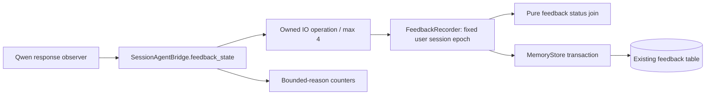

# V2.2 — 单调反馈回执与事务内 scope 校验

日期：2026-09-24。增量起点：`fb4c3b1b104accc144fdb547b878cfa800682fe4`（V2.1）。实现：`1741b4574aa12ec3b7eb138cc729d9766c01c020`；测试/基准快照：`b67a03c204fbd121825983a021bf55a1dccdce6d`。延续同一个 `research/agent-architecture-v2` 和 Draft PR #1，不修改 main。

本说明同时记录本增量的代码审计、外部依据、设计比较、实现契约、迁移与验收边界。全系统架构见 [ARCHITECTURE_V2](ARCHITECTURE_V2.md)，实测证据见 [TEST_REPORT 第14节](TEST_REPORT.md#14-v22-单调反馈回执增量2026-09-24)，设计决策见 [ADR 0007](adr/0007-monotonic-feedback-receipts.md)。V2.0/V2.1 的研究、审计与测量记录保留原日期，不冒充本轮新测量。

## 1. 问题不是“线程安全的数据库”就能解决

V2.1 已隔离 response ID、取消和原生准入，但 `SessionAgentBridge.feedback_state()` 将每次 observer 回调独立提交给线程池；`MemoryStore.update_feedback()` 按最后写入值覆盖 status/playback_state。即使 SQLite 的单条 UPDATE 完全原子，较早的业务观察仍可能最后到达。

修改前在准确的 V2.1 源码上执行如下序列：

```text
generated / unknown
→ interrupted / interrupted
→ 迟到的 queued / unknown
→ 数据库最终保存 queued / unknown（错误回退）
```

这是存储观察顺序错误，不是模型生成质量问题，也不是 response ID guard 本身失效。`response.done` 不能证明用户听完，`Task.cancel()` 也不能证明工作线程已回滚。

## 2. Architecture Audit — 本增量证据

| 问题 | 证据 / 影响 | 修改与验证 | 状态 |
|---|---|---|---|
| High：终态被旧回调覆盖 | V2.1 store.update_feedback 无状态合并；旧 queued 能覆盖 interrupted | 独立 pure join；重复、全部状态组合、排列与实际 SQLite 回写测试 | 默认 Bridge 路径已修复；低层兼容 API 仍可绕过 |
| High：回执写入仅检查用户 | 旧 callback 不检查当前 session/epoch；重建同名 session/receipt 存在迟到写入风险 | recorder 固定 user/session/epoch，事务内重新检查 | 已测试跨用户、同用户跨会话、删除与重建 |
| Medium：只锁协程不足 | 已启动 worker 可在 await 取消后继续，另一连接不受 asyncio.Lock 控制 | BEGIN IMMEDIATE 内 scope→read→join→write | 两连接竞争、取消后提交与回滚测试 |
| Medium：响应 ID 可重绑 | legacy update 可覆盖 response_id，令回执身份不一致 | 已绑定非空 ID 遇到不同 ID 明确拒绝 | 已实现；不证明请求因果归属 |
| Medium：生成观察覆盖更强播放证据 | 原 callback 对非 interrupted 状态统一回写 unknown | 不写 played_at/acknowledged_at，保留已有播放状态 | 仅模拟独立可信播放证据，真实 ACK 未实现 |
| Medium：失败原因混在 observer error | scope、invalid、capacity、timeout 不易区分 | 固定名称 Counter 和无内容日志 | 已实现本地计数；非完整 tracing/持久化审计流 |

本次是上述边界的定向增量，不声称重新完成整个仓库和全部第三方 SDK 的逐行安全审计。

## 3. 外部研究：事实、推导与项目决策

### SQLite 事务

来源：[Transaction](https://www.sqlite.org/lang_transaction.html)，页面更新 2026-02-18；[Isolation](https://www.sqlite.org/isolation.html)，页面更新 2022-04-18；访问 2026-09-24。

**Fact**：SQLite 同时只允许一个写事务；BEGIN IMMEDIATE 在读取前申请写事务，嵌套应使用 SAVEPOINT。默认连接之间不能读到未提交写入。

**Interpretation**：应用必须将“读取当前状态、判断 scope、决定新状态、写入”作为一个整体。仅把最后一条 UPDATE 包起来仍可能使用旧读值。

**Decision**：复用 MemoryStore.transaction 的 RLock、BEGIN IMMEDIATE 与嵌套 SAVEPOINT，不新增 SQL 字段或另一套数据库连接管理。

**Trade-off / 不适用**：更长的写事务与额外检查有开销，竞争时仍可能等待或失败。它不是多机数据库协议、断电持久化保证，也不替代供应商 SQLite 补丁核验。

### Python 取消与线程工作

来源：[Python 3.13 asyncio tasks](https://docs.python.org/3.13/library/asyncio-task.html)，访问 2026-09-24。

**Fact**：Task cancellation 是在后续执行机会注入 CancelledError；asyncio.wait 支持等待预算且不因超时自动取消未完成对象；任务需要有生命周期所有者。

**Interpretation**：取消等候者与停止已经运行的同步函数是不同事件。实际 worker 必须自己在副作用边界检查当前权限，等待超时只能称提交结果未确认。

**Decision**：沿用 OperationPool 对工作线程的所有权；让 recorder 在真正提交的事务里重新校验 scope；Bridge 对取消重新抛出，不把 timeout 计成成功或回滚。

**Trade-off / 不适用**：没有强杀线程、没有无限重试，也没有把本方案称为可靠消息队列。等候者取消后允许仍有效的记录完成合并，但不能影响新 scope。

### 状态合并规则是本项目设计，不是官方文档替我们指定

将 delivery state 构造成有限 join；交换律、结合律、幂等律来自本代码的穷举测试和规则推导。不是引用 SQLite/Python 来声称它们推荐了本项目的业务状态排序。

## 4. 三个候选方案

| 方案 | 好处 | 限制 / 代价 | 选择 |
|---|---|---|---|
| A：只增加 asyncio.Lock，依然覆盖字段 | 小改动 | 只约束一个 loop；不约束已取消等候的线程、其他连接或真实乱序事件 | 不采用 |
| B：scope-bound recorder + 状态 join + 一个事务 | 小范围可逆；可穷举；保留 schema/SDK；跨连接读改写一致 | 事务检查增加耗时；低层 API 仍是可信边界 | 本次采用 |
| C：带序号的持久化观察日志 / outbox / 单消费者 | 能保留所有事件与回放，容易审计遗漏 | 需要 schema、序号来源、重试、删除、积压和迁移协议；当前没有可验证的 provider 请求序号 | 作为后续独立增量 |

没有引入 Actor 框架、分布式事件总线、第二个 Reasoner LLM 或新的模型。MotionRuntime、SquatFSM、AgentLoop 决策语义和 Qwen wire contract 均未改变。

## 5. 实际组件与状态所有权



`coach/feedback_state.py` 只定义纯字符串状态规则，不 import SQLite、SDK、网络、UI 或 Agent。`coach/memory/feedback.py` 负责业务持久化能力，MemoryStore 仍是 SQL/事务所有者。Bridge 只提交观察，不自行选择用户、会话或 epoch。

这条旁路不经过 Pose→FSM 的高频路径，也不改变 rep count。默认 Qwen observer 通过已有反馈 sink 进入 Bridge。无 feedback_id 的原生回答和无持久回执的本地 safety 路径不会被此模块自动补建记录。

## 6. 状态合并契约

进度链为 `accepted < queued < generated < generation_unknown`。具体终态是 `generation_completed`、`generation_failed`、`generation_incomplete`、`rejected`。

具体终态细化 unknown；不同具体终态冲突合并为 `delivery_conflict`，不默认为成功。`interrupted` 是 delivery invalidation 的吸收态；它可以覆盖冲突摘要，但不等于“模型从没生成”或“扬声器已经静音”。本次没有保留每个历史观察的完整审计日志。

对相同反馈与相同已绑定 response ID 的状态集合，合并顺序和重复不影响最终状态：

```python
join(a, b) == join(b, a)
join(join(a, b), c) == join(a, join(b, c))
join(a, a) == a
```

这是有限状态函数的性质，不是整个异步系统的形式化证明。字段绑定采用首次非空 ID，此规则不是跨不同 response ID 的交换合并；不同非空 ID 会被拒绝并计数，不能用状态代数掩盖身份冲突。

`accepted` 由创建回执产生；`delivery_conflict` 由 join 推导。observer 不可直接提交这两种状态，也不可提交 `played` 或 `acknowledged`。未知 legacy status 返回 `unmanaged_existing_status`，保留原数据供维护者处理。

## 7. 事务与 scope

```mermaid
sequenceDiagram
  participant C as Observer callback
  participant O as OperationPool worker
  participant R as FeedbackRecorder
  participant D as MemoryStore / SQLite
  C->>O: state + feedback_id + optional response_id
  O->>R: apply(observation)
  R->>D: BEGIN IMMEDIATE
  R->>D: check current user + session memory_epoch
  R->>D: read existing receipt in same transaction
  R->>R: check session / response ID; join status
  alt still authorized and consistent
    R->>D: update only changed fields; COMMIT
    R-->>C: changed + bounded reason + merged status
  else deleted / replaced / invalid scope
    R->>D: ROLLBACK
    R-->>C: ScopeError
  end
```

为了保持既有 API 和 schema，本次读取回执使用 `store.update_feedback(user, id)` 的“无更新字段则返回现有记录”公共兼容行为。外层事务将这次读取与后续写入包在一起；Agent 不接触 SQL。后续可在 MemoryStore 增加明确的只读 get_feedback，但不能拆掉原子读改写边界。

scope 是 frozen recorder 创建时绑定的三元组 `(user_id, session_id, memory_epoch)`。事务检查 user 和 session 的 memory_epoch 都匹配，receipt 的 session_id 也必须匹配。不存在则拒绝，不 upsert，不调用 ensure_user/create_session。结束但未删除、epoch 未变化的 session 可接受迟到观察；close 后 Bridge 不再接纳新 callback。

既有 delete_session 会提升用户 epoch，因此其他旧 recorder 也可能失效。这是沿用的保守策略，不在本增量悄悄缩小删除影响范围。重建同名用户、会话和反馈 ID 必须创建新的 recorder，不能复用旧对象。

## 8. 播放证据与响应身份

首次非空 response_id 可以补充一个已存在、尚未绑定的回执。以后不同非空 ID 不重绑；None 不清空已有 ID。这只能证明本地身份一致，不能证明该 response 对应哪次客户端注入。`response_correlation=unverified` 保持不变。

生成状态回调不写 `played_at`、`acknowledged_at`，不把 playback_state 回写为 unknown。interrupted 可将没有更强证据的播放摘要改成 interrupted；已有 played/acknowledged 状态或独立时间戳保持。测试用显式 fixture 模拟可信播放证据，**不表示实际浏览器 ACK 已完成**。

## 9. 并发、容量、错误与观测

Bridge 仍共用 IO OperationPool，最多4个未结束工作；Qwen feedback observer 仍有16个异步 callback 上限。本次没有增设无界 queue 或 task。容量满可以拒绝，callback 遗失、close 与超时导致的最终记录不完整仍需后续可靠投递协议。

`feedback_metrics` 使用固定原因：advanced、metadata_enriched、duplicate、regression_ignored、outcome_conflict、response_id_conflict、unmanaged_existing_status、scope_rejected、invalid_observation、capacity_rejected、commit_wait_timeout、wait_cancelled、storage_error。它统计等候者实际观察到的结果，不是每条数据库提交的完整计数。

0.5秒仍是 Bridge 的等待预算，而不是 SQLite 工作线程硬超时。timeout 或取消后 worker 可能继续，并仍占 OperationPool 容量。日志明确为 `feedback_commit_unconfirmed`；不自动重试，不宣称写入未发生。容量、scope、非法输入分别记数；非预期存储异常计数后传播，交给原有 observer 生命周期回收。

日志不包含完整提示词、用户训练内容或密钥。extra 字段不等于已经部署采集器；完整 OpenTelemetry / 持久化反馈审计流仍未完成。

## 10. 测试与 benchmark 方法

`tests/test_feedback_receipts.py` 新增33项：纯代数6、存储18、双连接竞争2、Bridge异步7。穷举10个状态的全部100个有序对、1000个有序三元组，另测4种观察的24种排列。它们计入33个 unittest 方法，不把1000次断言虚报成1000项独立测试。

测试包括 late queued、取消等待后线程提交、两个独立 MemoryStore 连接、用户删除、同名重建、跨会话、不同 response ID、事务写后异常回滚、可信播放 fixture 保留、错误计数和已关闭 Bridge。线程竞争用 Event/barrier 与有限等待，finally 释放测试线程。

`benchmark_feedback.py` 复用现有百分位与源码 manifest，100次预热、1000次计时。每个 cycle 执行 generated→interrupted→queued 三次观察。legacy 与 guarded 是**不同正确性契约**，不是公平的“谁更快”竞赛；旧路径用作可重复缺陷对照。内存 SQLite、预建回执、无线程池/网络/磁盘同步；不能据此推导真实反馈延迟或耐久性。

同一 CI job 运行 pinned V2.1 与当前源码；可选模块先检查目标目录存在，再 import；manifest 核验所有 coach 模块路径及 SHA256，防止 editable install 把新模块混进旧基线。main 与当前通用架构 benchmark 继续保留。

## 11. 迁移与回滚

无需新增依赖、锁文件或数据库 schema 迁移，也不改变 SDK/VAD/媒体格式。正常入口自动使用新 recorder。自建 feedback sink 应注入同一个可信 scope，不得把模型提供的 user/session/epoch 直接用于构造。低层 MemoryStore.update_feedback 保留给可信维护调用，它不获得新的单调保证。

新增存储摘要 `delivery_conflict`：下游展示应显示冲突/未确认，不归类为成功；未知历史 status 不会被自动覆盖。既有 played_at 不清空，不把已保存错误状态通过猜测“修复”为成功。本方案只约束后续观察，未重建历史日志。

建议验收命令：

```bash
uv sync --locked --extra dev
uv run --no-sync python -m unittest discover -s tests -v
uv run --no-sync ruff check . --select E9,F63,F7,F82
uv run --no-sync python -m scripts.benchmark_feedback --iterations 1000 --output /tmp/feedback.json
```

回滚在独立分支 revert 本次实现/基准提交，或建立 `fb4c3b1` 的只读 worktree；不要 reset/force push 主工作分支，不删除数据库记录。回滚会重新暴露迟到回写问题。外部工具仍可能通过 legacy API 改写状态，这是兼容边界，不是新保证。

## 12. Remaining Risks / 后续验收

本次完成的是默认回执写入路径的状态单调性与事务内授权校验。尚未完成：原生/注入响应的严格请求因果映射，真正 browser playout ACK、played_at、spoken claim 验证，观察日志/outbox的可靠投递与重试，所有输出的删除即时撤销，完整 shutdown 硬上界，通用动作能力门和全链路时钟/trace。

真实摄像头、模型、AEC、扬声器、用户实验、磁盘满/断电、供应商 SQLite 补丁核验均不能由本次离线测试替代。继续保持 Draft PR；性能数字、测试通过和图表都不构成产品化或运动安全认证。
