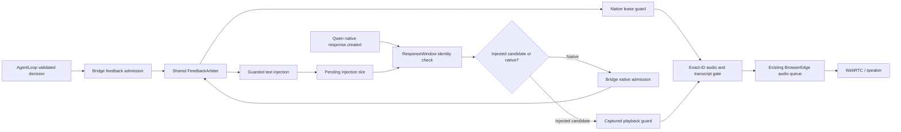
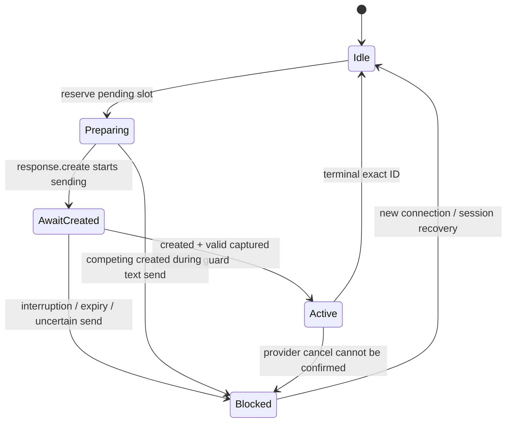

# Voice Output V2.1 — 响应身份、原生输出准入与取消隔离

日期：2026-09-23。增量起点：`46a2061fedebdd15c52cc4e8bd2441683ae01d14`。继续同一个 `research/agent-architecture-v2` 分支与 Draft PR #1，不重建 main，不强推。

本文件描述本轮代码变化；[ARCHITECTURE_V2](ARCHITECTURE_V2.md) 的 V2.0 说明仍适用于未修改模块。此次没有改变运动 FSM、数据库 schema、MCP 工具、媒体格式、运行依赖或默认 VAD。**完成的是响应身份保护和输出准入的一组增量，不是完整的请求因果关联或真实播放 ACK。**

## 1. 原来的真实问题

V2.0 已过滤部分旧 `done/delta`，但 `response.created` 仍会无条件替换 `_current_response_id`。因此，在当前回复存在时，迟到的另一个创建事件可以接管状态。重复创建还会再次产生 feedback 回调。旧响应终结后，其身份没有独立的有界退役窗口，重复创建可重新打开输出。

多个事件把缺失 `response_id` 当作“当前响应”的别名；外来 `response.output_item.added` 可以覆盖当前 item。音频 guard 与字幕 guard 不对称。服务端终结状态也没有完整区分 `failed`、`incomplete` 和真正的 `completed`。

应用注入请求发送后、服务端 response ID 返回前，是另一种状态。原来这个空隙没有显式所有者；新请求或 VAD 可以让迟到创建事件继承较新的反馈标识。

普通原生 Qwen 回答原本绕过应用仲裁。简单补一个 native gate 还会暴露另一个问题：VAD 已失效旧输出，普通 final transcript 再次无条件失效，会把刚开始的新原生回答也停止。

## 2. 设计选择及没有选择的方案

采用 `ResponseWindow` 作为 SDK 无关的同步身份门，保留一个活动响应和有界退役记录；适配器继续负责网络、PCM 与 Provider 回调。Bridge 增加原生回答准入函数，复用已有 `FeedbackArbiter`，而不是创建第二套优先级。

没有引入消息中间件、Actor 或新语音框架。没有假设 Qwen 支持回传自定义 request metadata，也没有把 `event_id` 当作客户端请求 ID。没有通过修改默认 VAD 参数来宣称关闭原生自动回答：目前查到的官方语言版本对这些字段并不一致，且本轮没有运行云端兼容性实验。

## 3. 实际连线

`SessionController` 显式设置 `qwen.native_response_gate = session_agent.admit_native_response`。**在这个组装入口中，原生音频和字幕也经过输出准入**；但原生模型的内容仍未经过 AgentLoop 的事实验证。独立使用 `DuplexQwenRealtime` 而不连接 gate 时，保持原有原生对话兼容行为，不能宣称所有外部调用都被仲裁。

## 4. ResponseWindow 契约

| 操作 | 行为 |
|---|---|
| `begin(id)` | ID 合法、未退役且无活动响应才接纳 |
| 重复当前 `created` | 幂等忽略；不重开音频，不重复 feedback |
| 不同 `created` 与活动响应竞争 | 不替换当前响应；新 ID 放入退役窗口，其后续包不接纳 |
| `accepts(id)` | 必须明确且等于当前 ID；缺失 ID 不再回退到 current |
| `finish_audio(id)` | 同一响应只生效一次；之后不再接纳其 audio delta |
| `finish(id)` | 只有当前 ID 可以结束当前状态；终结前于创建的 ID 也退役 |
| `invalidate()` | 退役当前 ID 并清空活动状态 |

ID 上限 256 字符。默认退役窗口 256 项；容量合法性校验拒绝 bool、浮点和非正整数。`retired_count`、固定标签的 `metrics` 提供观测。**256 项是有限重放保护窗口，不是整个会话生命周期的反重放证明**；很久以前已淘汰的 ID 无法仅靠该窗口识别。

`ResponseWindow` 不持有文本、音频、用户身份或数据库。SDK 的 `_current_response_id/_is_responding` 是适配器同步维护的兼容字段，不是第二套准入决策。

## 5. 注入状态：一个 pending 槽，而不是队列

pending 包含 feedback ID、播放有效性回调和 4 秒创建期限。`_request_sent` 在等待网络发送前设置，覆盖“写入可能已发生，但等待方收到错误/取消”的情况。另一个注入不能覆盖未绑定请求，也不会无限排队。

正常 AgentLoop 返回后，其 `ActionContext.is_current()` 可能失效，因此等待服务端创建时保留的是更长生命周期的 `playback_guard`，不是把已经完成的 Agent 任务当作播放所有者。

VAD 中断已发送、尚未取得响应 ID 的请求时，进入 `output_blocked_reason=unresolved_response_after_interruption`。后来的未知创建、字幕和音频都不被新一轮继承；后续注入返回拒绝。该状态不会因某个偶然的 `done` 或超时自动解除。显式重建连接/会话是恢复边界。

这是一种可用性取舍：遇到身份不确定时，可能需要重新开始会话，而不是继续播放可能属于旧请求的声音。本地动作暂停和已保存事实不依赖此语音恢复；也没有额外提供离线可听告警。

## 6. 必须保留的因果关联限制

官方 `response.created` 提供服务端 `response.id`，没有承诺回传发送 `response.create` 时的客户端 ID。本轮没有新增未文档化的 wire 字段。

无冲突地等待注入时，适配器仍保留旧路径的 **ordered injection candidate**：将下一个创建事件作为候选响应，并使用已取得的注入 lease。若此前还有不可见的原生自动响应在途，候选不一定等于因果来源。`ordered_injection_candidate` 计数器明确标出该路径；Bridge 新写入的 feedback facts 和返回 receipt details 标注 `response_correlation=unverified`。

因此不能说“本轮完全修复了手动注入与原生响应的因果对应”，也不能凭该 feedback ID 证明音频内容来自给定证据。真正完成需要可验证的服务端关联契约，或经过 live 验证的单一请求发起模式。

## 7. 原生输出准入与 final transcript

原生回答按 `FeedbackKind.ANSWER` 请求已有仲裁器，lease 上限暂为 12 秒。它不能抢占 SAFETY/EMERGENCY；较低优先级提示不能覆盖它。Bridge 已关闭或仍有应用任务/待处理工作时，拒绝原生准入。准入函数不读取 SQLite，不调用模型，不等待 IO。

guard 检查 bridge 生命周期、输出 generation 和 lease。每个明确当前 ID 的音频与字幕事件都要复查。guard 失效或抛异常时，停止接纳并发出本地 flush，不让字幕继续表现为有效回复。

VAD 设置 `_awaiting_user_transcript` 并立即使旧输出失效。普通 final transcript 消费这个标记而不重复撤销新原生回答。历史问题/不适报告仍会在路由前失效原生回答；没有 VAD 的直接文本输入也保留失效语义。运动安全事件和关闭调用通用失效函数，不冒充一次用户 VAD。

边界：final transcript 到达前，原生模型可能已发送部分音频；后续分类无法撤回已播放内容。关键词路由本身也没有升级为完善的语义分类器。

## 8. 取消、关闭和重连

`_on_interruption` 先同步撤销本地响应，再请求 Provider cancel。最多保留一个未完成 cancel task；等待预算为 0.2 秒。超时、任务被取消或异常时，输出进入阻断状态，遗留任务仍被引用并回收异常，不伪称它已经结束。

新创建事件如果与仍未完成的 cancel 竞争，也保守阻断，避免迟到的无目标 cancel 撤销继任响应。调用者放弃等待同样不允许重新建立一个错误的新输出代次。

关闭在第一个 await 之前设置 closing、增加 reader epoch 与 voice generation、清空 pending 并使当前状态失效。旧 reader 捕获自己的 client 与 epoch，不能通过新的 `self._client` 消费或污染新连接。取消与 observer 的局部等待有界，但 **第三方 SDK close、原生 executor 和进程退出并非都已被证明有硬上限**。旧 client 的 cancel 永不结束时，不应在同一 adapter 上无休止重连；应用新会话或进程级监督仍需后续治理。

## 9. 生成状态与真实播放分开

| Provider terminal status | Feedback observation |
|---|---|
| completed | generation_completed |
| failed | generation_failed |
| incomplete | generation_incomplete |
| cancelled | interrupted |
| 缺失或未知 | generation_unknown |

缺失 status 的旧事件可用于结束本地输入流，但不再记为成功生成。旧测试中的成功 fixture 显式补上 `status=completed`，测试和断言未删除。失败/取消时清理尚未播放的本地队列，不能撤回已听到的声音。

本轮仍不写入真实 `played_at`。`response.audio.done`、`response.done`、WebRTC 接收统计、浏览器处于播放状态，都不能单独证明某句提示被扬声器完整输出。已有音频轨道仍是连续 WebRTC 流，没有端到端 utterance ID 播放回执。

对播放回执的下一步设计应明确 observation kind、response ID、输出 generation、采样时间、浏览器状态和证据强度。比如 `browser_received`、`render_observed`、`user_acknowledged` 不能合并成同一个 `played=true`。本轮只完成这项研究与边界说明，未实现新的浏览器 ACK 协议。

## 10. 防御性解析与观测

缺失/外来 ID 的 item、done、audio delta、audio transcript 不会修改当前状态。非对象事件、畸形 response、无效 Base64 音频会被拒绝；单个 Base64 delta 上限 262144 字符，避免无界解码。observer 抛异常不能跳过本地打断。

新增固定标签计数：duplicate_created、conflicting_created、retired_created、rejected_event、guard_rejected、native_admitted、native_rejected、ordered_injection_candidate、pending_injection_rejected、malformed_audio 等。阻断日志输出原因码，不输出完整 prompt、音频或 Provider 错误正文。原有生成统计日志保留。

这不是 OTel 全链路 tracing。并行 feedback observer 的持久化更新顺序、严格 terminal-state reducer、数据删除到所有语音出口的原子失效，也尚未完成。

## 11. 测试与微基准

新增纯 ResponseWindow 测试、Bridge native admission 测试以及固定 SDK 的离线事件交错测试。覆盖重复/竞争创建、终结后重放、无 ID 事件、外来 item、字幕过期、pending 覆盖、未绑定请求打断、发送不确定、原生拒绝、guard 撤销、失败状态、畸形包、observer 失败、取消超时、旧 reader 和关闭期间发送。

本地 Python 3.13.5 环境不能联网同步依赖：`uv sync --locked --extra dev` 遇 DNS 错误。纯状态/Bridge 18 项在该环境通过；无真实 SDK 的 shape stub 仅用于辅助逻辑检查，不作为 SDK 兼容性证据。最终完整 CI 结果应以 [TEST_REPORT](TEST_REPORT.md) 的本轮增补和对应 run 工件为准。

`benchmark_architecture.py` 增加 `voice_response_identity_cycle`：预建 ID，测 begin → accepts → finish_audio → finish，预热100次、采样5000次、nearest-rank分位数。基线没有该模块，标记 unavailable，不计算虚构提速率。该微基准不包含 Provider、语音解码、网络或真实播放。

## 12. 迁移与验收

不变更 `.env` 默认值、VAD、数据库表或依赖锁。非规范的测试 Provider 必须携带明确 response_id，不能依赖 missing ID 自动绑定当前响应。成功结束必须带 `status=completed`，否则是 generation_unknown。native_response_gate 是可选的本地能力回调，返回有效性函数或 None；它不是 MCP tool，不允许模型选择。

操作者遇到 `voice_output_blocked` 应停止并重新开始测试会话，保留日志原因码，不通过清空私有字段绕过隔离。不能自动复述上一个可能已经发送的请求。无 API/硬件验收时，不能把本分支设为生产安全保证。

## 13. 研究依据与版本限制

以下为本轮外部核查，不替代仓库已验证的旧协议。

1. [Qwen 服务端事件](https://www.alibabacloud.com/help/en/model-studio/server-events)，2026-09-23访问：response.id、各 delta 的 response_id、生成终结状态；没有已核实的客户端请求 ID 回传承诺。
2. [Qwen 客户端事件（中文）](https://www.alibabacloud.com/help/zh/model-studio/client-events)，页面标注2026-06-16：VAD自动响应；当前 conversation.item.create 文档仅列 function_call_output。**这与项目固定版本的 message/input_text 路径存在能力描述差异。** 本轮没有云调用，不据此断言原项目路径一定不可用，也不声称当前在线接口仍已验证。
3. [Qwen 服务端事件（繁体）](https://www.alibabacloud.com/help/tc/model-studio/server-events)，页面标注2026-09-02：示例含 create_response/interrupt_response；客户端语言版本未同样列全，不能据示例擅自改变所有模型的默认行为。
4. [W3C WebRTC](https://www.w3.org/TR/webrtc/)，2026-09-23访问：接收/同步源信息即使没有接入播放 sink 也可更新。因此接收统计不是已听见证明。

工程决定：保持旧协议与默认 VAD；本地加强可证明的 ID 和准入边界；将不能证明的因果关联、在线兼容性和真正播放回执分别列为未完成，不通过填字段假装解决。
